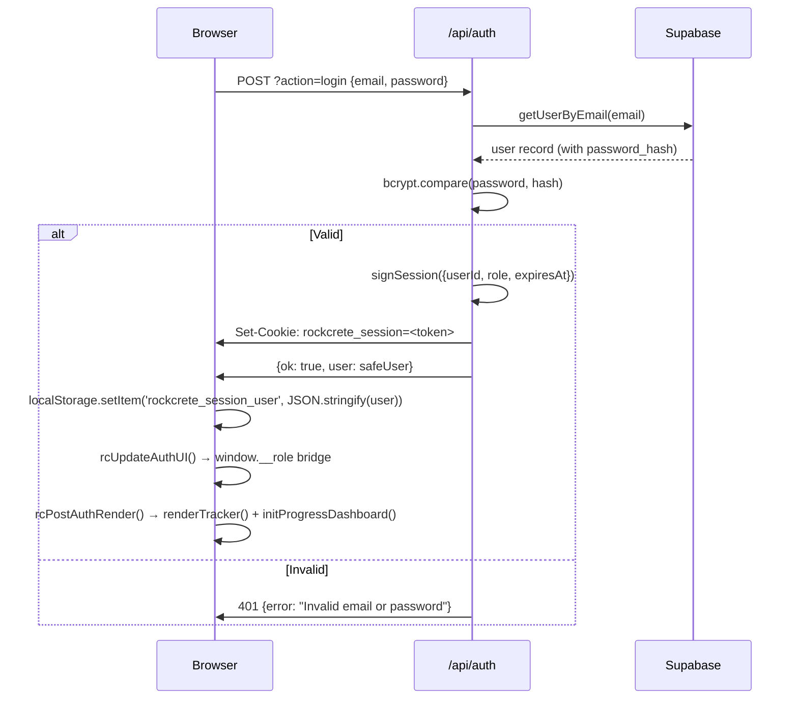
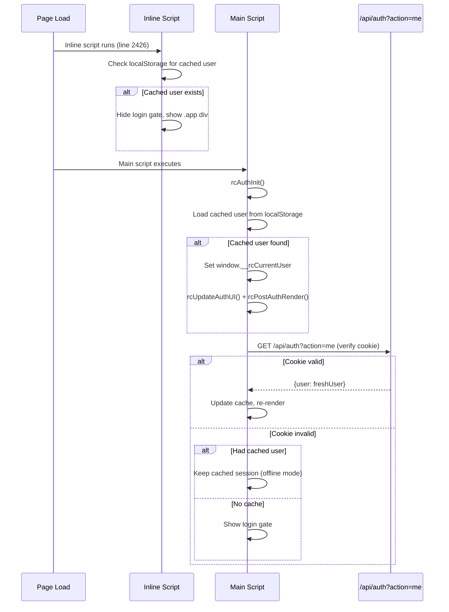

# Auth System

## Overview

The dashboard uses a cookie-based authentication system with PBKDF2 password hashing and HMAC-SHA256 signed session tokens. All auth logic lives in two files:
- `api/auth.js` — Auth API endpoints (login, logout, session check, password reset)
- `api/db.js` — Session helpers, user CRUD, Supabase client

## Role Hierarchy

```
super_admin > admin > pm > webdev > designer > client_admin > client > viewer > guest
```

| Role | Can Edit Tracker | Can Manage Users | Can View Settings | Can See Admin Panel |
|------|:---:|:---:|:---:|:---:|
| super_admin | ✅ | ✅ | ✅ | ✅ |
| admin | ✅ | ❌ | ✅ | ✅ |
| pm | ✅ | ❌ | ❌ | ❌ |
| webdev | ✅ | ❌ | ❌ | ❌ |
| designer | ✅ | ❌ | ❌ | ❌ |
| client_admin | ✅ | ❌ | ❌ | ❌ |
| client | ❌ | ❌ | ❌ | ❌ |
| viewer | ❌ | ❌ | ❌ | ❌ |

## Session Cookie

| Property | Value |
|----------|-------|
| Name | `rockcrete_session` |
| HttpOnly | Yes |
| SameSite | Strict |
| Path | `/` |
| Max-Age | 604800 (7 days) |
| Secure | Only when `VERCEL_URL` is set |

### Cookie Payload
```json
{
  "userId": "usr-xxx",
  "role": "super_admin",
  "expiresAt": 1716300000000,
  "_sig": "hmac-sha256-hex-signature"
}
```

Encoded as base64url. Verified by recomputing HMAC-SHA256 with `SESSION_SECRET` and doing constant-time comparison.

## Login Flow



## Session Restore on Refresh



## Key Functions (index.html)

| Function | Purpose |
|----------|---------|
| `rcAuthInit()` | Boot-time auth check with localStorage fallback |
| `rcUpdateAuthUI()` | Sets `window.__role` bridge, shows/hides UI elements |
| `rcGateLogin()` | Login form submit handler |
| `rcAuthLogout()` | Logout + clear cookie + clear localStorage |
| `rcPostAuthRender()` | Re-render tracker + progress after auth change |
| `rcSaveSessionLocally(user)` | Save user to localStorage |
| `rcClearSessionLocally()` | Clear localStorage session |
| `rcLoadSessionLocally()` | Load user from localStorage |

## `window.__role` Bridge

Legacy compatibility layer created by `rcUpdateAuthUI()`. Maps the new user-based auth to the old role API:

```javascript
window.__role = {
  current: () => 'admin',        // Current role string
  isAdmin: () => true,           // super_admin or admin
  isTeam: () => true,            // admin, pm, webdev, designer, client_admin
  isClient: () => false,         // client or client_admin
  signOut: () => rcAuthLogout()  // Logout helper
}
```

Used by tracker and progress code to check permissions (e.g., `trackerCanEditTracker()` checks `window.__role.isTeam()`).

## Password Hashing

Uses `bcryptjs` with default salt rounds (10). Passwords are hashed server-side in `api/auth.js` before storing in Supabase.

## Password Reset Flow

1. User submits email to `POST /api/auth?action=forgot-password`
2. Server generates a 6-digit verification code
3. Code stored in `reset_tokens` table with 15-min expiry
4. User enters code at `POST /api/auth?action=verify-reset-code`
5. On valid code, server returns a one-time reset token
6. User submits new password with token to `POST /api/auth?action=reset-password`

> **Note**: Email sending is not implemented. The code is logged server-side and shown in the API response for development purposes.
