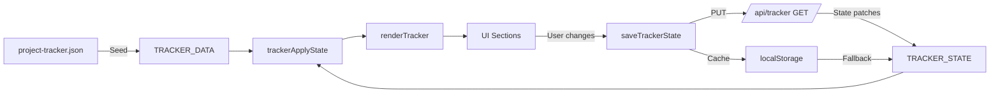

# Tracker System

## Overview

The Project Tracker is the core feature of the dashboard. It displays project phases, tasks, milestones, calendars, kanban boards, and role-based checklists. Data flows from a static seed file + Supabase persistence.

## Data Flow



## Seed Data: `data/project-tracker.json`

Structure:
```json
{
  "schemaVersion": "1.0",
  "projectId": "rockcrete-usa-rebuild",
  "projectTitle": "Rockcrete USA Website Rebuild",
  "taskStatuses": ["not_started", "in_progress", "waiting_client", "ready_review", "done"],
  "accessStatuses": ["not_requested", "requested", "received", "blocked"],
  "roles": [
    { "id": "pm", "label": "Project Manager", "color": "#..." },
    { "id": "design", "label": "Design", "color": "#..." },
    { "id": "development", "label": "Development", "color": "#..." },
    { "id": "client", "label": "Client", "color": "#..." }
  ],
  "team": [
    { "id": "unassigned", "name": "Unassigned" },
    { "id": "daniel", "name": "Daniel" },
    ...
  ],
  "phases": [
    { "id": "phase-1", "label": "Phase 1", "title": "Discovery & Architecture", "startDate": "2026-05-14", "endDate": "2026-06-16" },
    ...
  ],
  "calendar": [
    { "date": "2026-05-14", "title": "Project Kickoff", "type": "meeting", "duration": "1 hr" },
    ...
  ],
  "accessRequests": [
    { "id": "access-ga4", "title": "Google Analytics 4", "status": "requested", ... },
    ...
  ],
  "tasks": [
    { "id": "p1-dev-current-site-audit", "phase": "phase-1", "role": "development", "title": "...", "status": "not_started", "dueDate": "2026-05-30", "clientVisible": true, "description": "..." },
    ...
  ]
}
```

## State Management

### TRACKER_STATE Structure
```json
{
  "tasks": {
    "p1-dev-current-site-audit": {
      "id": "p1-dev-current-site-audit",
      "status": "in_progress",
      "dueDate": "2026-05-30",
      "assigneeId": "usr-xxx",
      "updatedAt": "2026-05-21T...",
      "updatedBy": "admin",
      "comments": [
        { "id": "cmt-xxx", "text": "Started audit", "author": "Super", "timestamp": "...", "edited": false }
      ]
    }
  },
  "accessRequests": {
    "access-ga4": { "id": "access-ga4", "status": "received" }
  }
}
```

### State Merge: `trackerApplyState()`
Iterates `TRACKER_STATE.tasks` and applies patches to `TRACKER_DATA.tasks`:
- Overrides: `status`, `dueDate`, `assigneeId`
- Appends: `comments`
- Applies access request status overrides

### Persistence

| Layer | Key/Endpoint | Purpose |
|-------|-------------|---------|
| **Supabase** | `tracker_state` table | Primary persistence |
| **localStorage** | `rockcrete_project_tracker_state` | Offline fallback |
| **API** | `PUT /api/tracker` | Saves to Supabase |

On save: writes to both localStorage AND API simultaneously.

## Render Functions

| Function | Target Element | Renders |
|----------|---------------|---------|
| `renderTrackerSummary()` | `#tracker-summary` | 4 KPI cards: progress %, current phase, next meeting, waiting items |
| `renderTrackerPhases()` | `#tracker-phase-strip` | Phase cards with progress bars |
| `renderTrackerCalendar()` | `#tracker-calendar-grid` | Monthly calendar with meetings/gates |
| `renderTrackerKanban()` | `#tracker-kanban-board` | Tasks grouped by status columns |
| `renderTrackerRoles()` | `#tracker-role-checklists` | Role-based task checklists with checkboxes |
| `renderTrackerAccess()` | `#tracker-access-requests` | Access request cards with status selects |
| `renderAllPhaseEmbeds()` | `#phase-{N}-task-embed` | Task progress within each phase screen |

## Permission Checks

```javascript
trackerIsAdmin()      // window.__role?.isAdmin() — super_admin or admin
trackerIsTeamOrAdmin() // isAdmin() || isTeam() — can edit
trackerCanEditTracker() // trackerIsTeamOrAdmin()
```

Non-admin users see read-only views (badges instead of selects, no checkboxes).

## Event Handling

All tracker events use delegated listeners on `#screen-tracker`:

| Event | Selector | Action |
|-------|----------|--------|
| `change` | `[data-tracker-status]` | Update task status |
| `change` | `[data-tracker-due]` | Update task due date |
| `change` | `[data-tracker-assign]` | Update task assignee |
| `change` | `[data-tracker-access-status]` | Update access request status |
| `click` | `[data-tracker-check]` | Toggle task checkbox |
| `click` | `[data-tracker-comment-btn]` | Add comment to task |

All changes call `saveTrackerState()` which:
1. Updates `TRACKER_STATE` in memory
2. Calls `trackerSaveLocalState()` (localStorage)
3. Calls `saveTrackerRemote()` (PUT /api/tracker)
4. Calls `renderTracker()` to reflect changes
